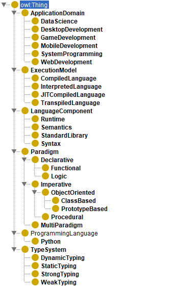
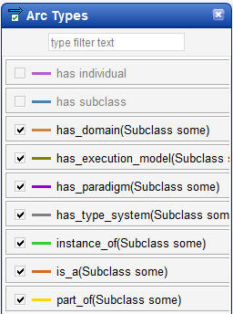
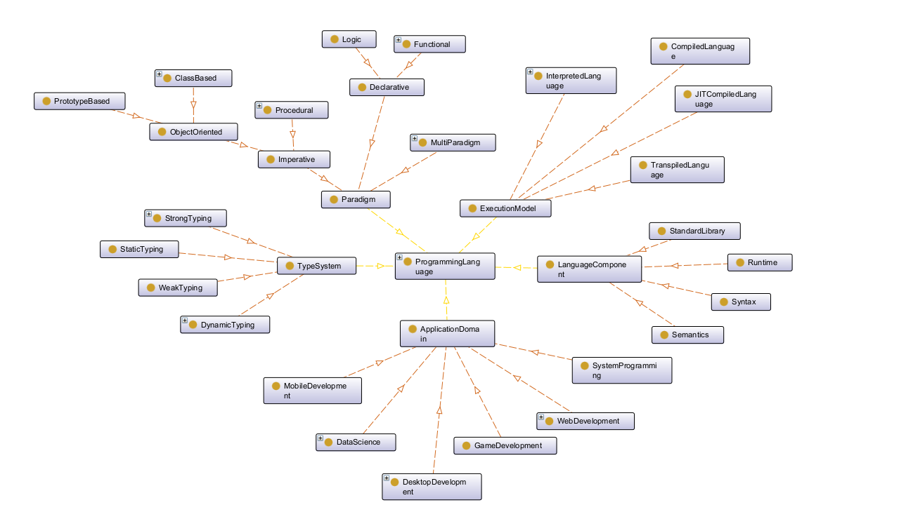
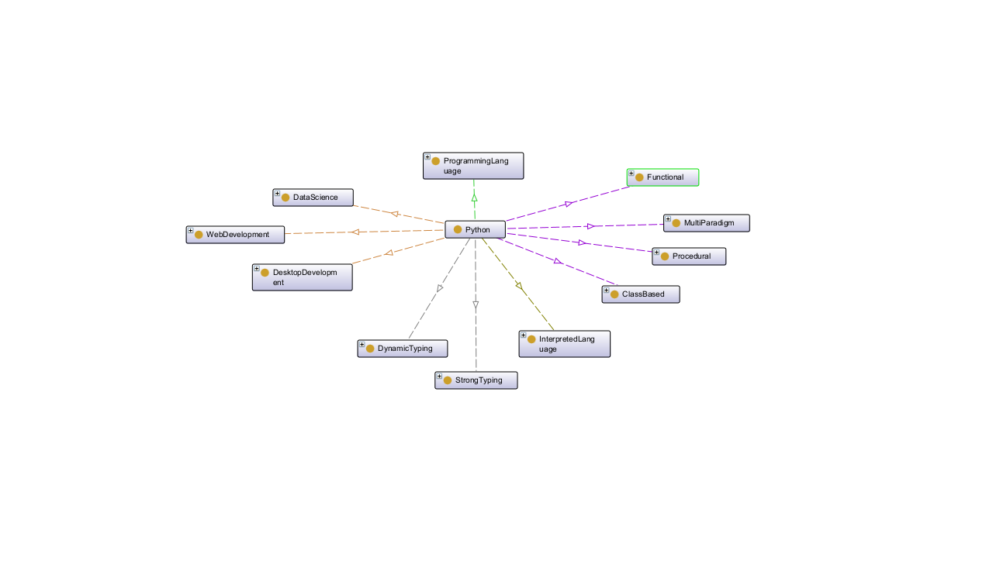

# Лабораторная работа №3 *(Представление знаний)*

**Предметная область:** Онтология по языкам программирования

**Используемое программное обеспечение:** Protege 5.6.9

## Структура проекта:

```
lab_work_3/
├── docs/
├── imgs/                               # Изображения
|   ├── classes.png                     # информационные единицы онтологии
|   ├── graf_1.png                      # граф онтологии
|   ├── legend.png                      # типы связей онтологии
|   └── python.png                      # граф онтологии индивида Python
├── ontologies/                         # Проекты онтологии
|   └── programming_language/           # Онтология по языкам программирования
|       ├── ontografs/                  # Графы проекта
|       |   ├── graf_1.graph            # граф онтологии
|       |   └── python.graph            # граф онтологии индивида Python
|       └── programming_language.owx    # проект отнологии
└── README.md                           # Отчет
```

## Онтология

Онтология состоит из 34 информационных единиц:



Отология задейсвтует 7 типов связей:



Граф онтологии:



Граф онтологии на примере индивида языка программирования Python:



В ходе работы построена расширяемая онтология, позволяющая классифицировать языки программирования по четырём независимым осям (ApplicationDomain, ExecutionModel, Paradigm, TypeSystem). Добавлен индивид Python с демонстрацией связей.